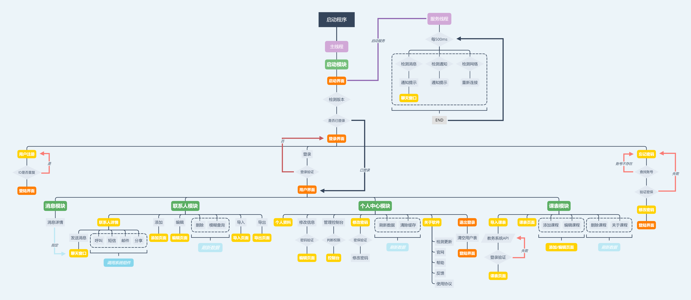

# 模块说明

+ 登录验证模块包含“用户验证、用户注册、找回密码”功能；

+ 通讯录管理模块包含“云端联系人获取、添加自定义联系人、删除联系人、编辑联系人、导入联系人、导出联系人、模糊查询、联系人过滤、详情资料查看、联系人分享、拨打电话、发送短信、发送电子邮件、发送即时消息”功能；

+ 即时通讯模块包括“即时通讯、离线消息接收、信息列表管理、消息提醒”功能；

+ 个人中心模块包括“查看个人资料、编辑个人资料、修改密码、刷新数据、清空缓存”功能；

+ 课程表模块包括“导入课表、查看课程、编辑\新增课程";

+ 软件自检模块包括“用户登录检测、软件版本更新检测、查看软件信息、软件问题反馈”功能。

# 模块图

#页面

##系统模块
+ 欢迎页面 	`ctivity_main`——`MainActivity``

+ 登录页面	`activity_login`——`LoginMainActivity`

+ 注册页面	`activity_reguser`——`RegActivity`

+ 忘记密码	`activity_forgeta`——`ForgetActivity`

##联系人模块
+ 联系人页面——`activity_contact`——`ContacterActivity`

+ 联系人布局——`peoplelist`

+ 资料卡——`activity_peocard`——`PeocardActivity`

+ 删除用户——`activity_contact`——`ContacterActivity`

+ 修改用户资料——`activity_uppeo`——`upPeoActivity`

+ 新建用户——`activity_newpeo`——`NewPeoActivity`

+ 导入用户——`activity_impro`——`Impro_Activity`

+ 导出用户——`activity_out`——`OutActivity`

##消息模块
+ 消息列表——`activity_infolist`——`InfolistActivity `   
	消息卡片——`infocord`
	
+ 聊天窗口——`activity_chat`——`ChatActivity`  
    气泡——`chatcord`

+ 课程表模块

+ 查看课表——`activity_kcb`——`KcbActivity`  
	导入课表——`activity_loginkcb`——`LoginKcbAcitivity`  
	编辑课程——`activity_editcourse`——`EditCourseActivity`

+ 新建课程——`activity_editcourse`——`EditCourseActivity`

##个人中心模块

+ 个人中心——`activity_my`——`MyActivity`
	查看个人资料——`activity_peocard`——`PeocardActivity`

+ 修改个人资料——`activity_upmydata`——`UpMydataActivity`

+ 修改密码——`activity_forgeta`——`ForgetActivity`

+ 管理员页面——为完成

+ 管理员增加用户页面——未完成

+ 管理员查看空课页面——未完成

+ 新媒体账号密码查看——未完成

+ 新建邀请码——未完成

+ 群发消息——未完成

